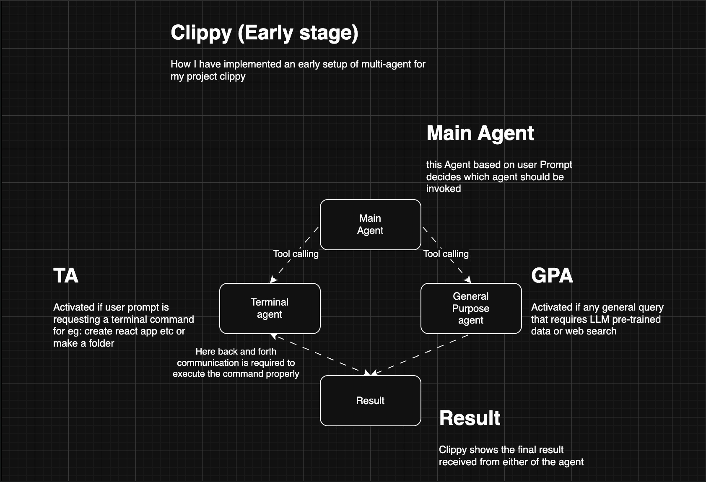

⸻

<p align="center">
  
</p>

<h1 align="center">🔍 Clippy – Your Cross-Platform Smart Search Butler</h1>

<p align="center">
  <i>Your personal AI-powered assistant, beautifully blending a lightning-fast search interface with intelligent agent capabilities.</i>
</p>

<p align="center">
  <b>✨ Search files instantly • 📁 Summarize files • 💬 Get concise answers • 🤖 Run terminal commands • 🎯 Stunning native UI</b>
</p>

---

## 🧠 Features

| Feature                       | Description                                                                    |
| ----------------------------- | ------------------------------------------------------------------------------ |
| 🔎 **Smart Search**           | Type anything to trigger intelligent file search with instant result sorting.  |
| 🧠 **Agent Assistant**        | Get AI-powered summaries, quick definitions, or code in seconds.               |
| 📂 **File Drop**              | Drag and drop a file to get instant AI summarization and indexing.             |
| 🛠️ **File & App Creation**    | Create files, folders, or even React or Vite apps directly from the interface. |
| 🌐 **Environment Details**    | Retrieve and display your system's environment details effortlessly.           |
| 🖥️ **Native UI**              | Fully native desktop UI using Flet — beautiful, frameless, and minimal.        |
| 🔁 **Debounced Input**        | Performance-optimized search using a custom debouncer utility.                 |
| 🪄 **Precise Results**        | Responses are short, focused, and designed for quick utility.                  |
| 🔌 **Cross Platform**         | Runs seamlessly on Windows, macOS, and soon Linux.                             |
| 🎨 **Animations Coming Soon** | Eye-candy animations and transitions planned with Flet’s animation support.    |

---

## 🧠 Smart Implementation

<p align="center">
  
</p>

Clippy is designed with a highly intelligent architecture to provide seamless and efficient user interactions:

- **Team Agent Routing**: Clippy uses the Team Agent as a router to intelligently redirect user prompts to either the General Purpose Agent (GAP) or the Terminal Agent (TER) based on the context of the request.
- **Terminal Agent (TER)**:
  - Adapts to the local environment by loading shell profiles, ensuring compatibility with the user's system.
  - Executes subprocesses and smartly appends `yes` or `-y` to commands for zero user intervention, making operations like installations completely hands-free.
- **General Purpose Agent (GAP)**: Equipped with web search capabilities, it can fetch information from the internet to provide accurate and context-aware responses.
- **Shared Memory**: All agents share a common memory, enabling smooth back-and-forth communication. This is particularly useful for complex terminal operations, such as creating a React app, where the General Purpose Agent can suggest a name, and the Terminal Agent can execute the command seamlessly.
- **Cross-Platform System Directory Access**: Clippy includes a cross-platform method to retrieve system directories like Documents, Desktop, Downloads, etc., allowing users to act on these directories with ease, such as organizing files or performing batch operations.

Clippy's architecture ensures a cohesive and intelligent experience, making it a powerful tool for both casual and advanced users.

---

## 🖥️ Why Native Wrapper?

The native wrapper is a crucial part of Clippy's architecture, providing the following benefits:

- **Global Key Implementation**: Enables the use of global hotkeys, allowing Clippy to be triggered instantly from anywhere on your system.
- **Overlay Permissions**: Grants the ability to overlay Clippy on top of any app or screen, ensuring seamless accessibility without disrupting your workflow.

These features make Clippy a truly integrated and efficient tool for your desktop environment.

---

## 📸 Sneak Peek

<p align="center">
  
  <h4 align="center">🎯 Example: Quickly check your Python environment version</h4>
  <p align="center"><i>Clippy helps developers save time by instantly retrieving environment details without needing to open a terminal manually.</i></p>
</p>

<p align="center">
  
  <h4 align="center">📂 Example: Create a text file in your Documents folder</h4>
  <p align="center"><i>Perfect for users who need to quickly jot down notes or create files in specific directories without navigating through multiple menus.</i></p>
</p>

<p align="center">
  
  <h4 align="center">💬 Example: Get quick answers using the General Purpose Agent</h4>
  <p align="center"><i>Clippy acts as your personal assistant, providing concise answers to questions, definitions, or even code snippets in seconds.</i></p>
</p>

<p align="center">
  
  <h4 align="center">🖥️ Example: Open apps, files, and folders with ease</h4>
  <p align="center"><i>Clippy simplifies your workflow by letting you open frequently used apps or files instantly, saving you from searching through your system.</i></p>
</p>

---

## 🚀 Getting Started

> ⚠️ **Note**: The steps below will not completely set up the project as it is currently under heavy development. The setup process and dependencies are evolving rapidly, and maintaining up-to-date setup documentation is challenging. By the final release, I plan to consolidate all setup steps into a single bash script for ease of use.

1. **Clone this Repo**

   ```bash
   git clone https://github.com/smil-thakur/Clippy.git
   cd Clippy
   ```

2. **Install Requirements**

   We recommend using a virtual environment:

   ```bash
   python -m venv clippyENV
   source clippyENV/bin/activate  # or clippyENV\Scripts\activate on Windows
   pip install -r requirements.txt
   ```

3. **Setup .env**

   Create a `.env` file and add your Gemini API Key:

   ```env
   GEMINI_API_KEY=your_api_key_here
   ```

4. **Run the App**

   ```bash
   python src/main.py
   ```

---

## 📁 Project Structure

<ul>
  <li><strong>MACOS Native/</strong>
    <ul>
      <li><strong>Clippy/</strong>
        <ul>
          <li><strong>Clippy/</strong>
            <ul>
              <li><strong>AppDelegate.swift</strong> – App delegate for macOS native app</li>
              <li><strong>Assets.xcassets/</strong> – App icons and assets</li>
              <li><strong>Base.lproj/Main.storyboard</strong> – Main storyboard for UI</li>
              <li><strong>Clippy.entitlements</strong> – App entitlements</li>
              <li><strong>Info.plist</strong> – App configuration</li>
              <li><strong>ViewController.swift</strong> – Main view controller</li>
            </ul>
          </li>
          <li><strong>Clippy.xcodeproj/</strong> – Xcode project files</li>
        </ul>
      </li>
    </ul>
  </li>
  <li><strong>src/</strong>
    <ul>
      <li><strong>agents/</strong>
        <ul>
          <li><strong>agentsUtility.py</strong> – Utility functions for agents</li>
          <li><strong>mainAgent.py</strong> – Main agent logic</li>
        </ul>
      </li>
      <li><strong>agentTools/</strong>
        <ul>
          <li><strong>agentTools.py</strong> – Tools for agent integration</li>
        </ul>
      </li>
      <li><strong>assets/</strong> – App assets like icons and logos</li>
      <li><strong>components/</strong>
        <ul>
          <li><strong>aiResponseContainer.py</strong> – AI response container</li>
          <li><strong>resultSection.py</strong> – Result section component</li>
          <li><strong>resultSectionContainer.py</strong> – Container for result sections</li>
        </ul>
      </li>
      <li><strong>enums/</strong>
        <ul>
          <li><strong>commonExtension.py</strong> – Common file extensions</li>
        </ul>
      </li>
      <li><strong>states/</strong>
        <ul>
          <li><strong>thinkingStates.py</strong> – States for AI thinking</li>
        </ul>
      </li>
      <li><strong>utilities/</strong>
        <ul>
          <li><strong>checkPermissions.py</strong> – Permission checking utility</li>
          <li><strong>debouncer.py</strong> – Input debouncer utility</li>
          <li><strong>fileUtils.py</strong> – File-related utilities</li>
          <li><strong>getResourcePath.py</strong> – Resource path resolver</li>
          <li><strong>listSorter.py</strong> – List sorting utility</li>
          <li><strong>openApp.py</strong> – Utility to open apps</li>
          <li><strong>searchUtils.py</strong> – Search-related utilities</li>
        </ul>
      </li>
      <li><strong>main.py</strong> – Main entry point of the app</li>
    </ul>
  </li>
  <li><strong>memory.db</strong> – Local database for memory</li>
  <li><strong>requirements.txt</strong> – Python dependencies</li>
  <li><strong>README.md</strong> – You are here!</li>
  <li><strong>pyproject.toml</strong> – Python project configuration</li>
  <li><strong>pyrightconfig.json</strong> – Pyright type-checking configuration</li>
</ul>

---

## 🧩 Tech Stack

- 🐍 **Python**
- 💻 **Flet** – Native cross-platform UI framework
- 🧠 **Agno Agent** https://www.agno.com/
- 🪄 **Gemini API** (via Agno Models)
- ⚙️ **Asyncio, Debouncing, File system search, and more**

---

## 🎯 Vision

We’re building the next-gen AI-powered Spotlight for your desktop – a hybrid between a blazing-fast search tool and a context-aware assistant. This is just the beginning. In the future, ClippyAI will include:

- 🖼️ **Multi-Modal Agent for Drag-and-Drop File Analysis**: Implement a multi-modal agent capable of analyzing files dropped into the interface. This feature will allow users to extract insights, summaries, or metadata from files such as PDFs, images, or code files. This is the next major feature we are actively working on.
- 🔊 **TTS Summarization of Documents**: Provide audio summaries of documents for accessibility and convenience.
- 🧠 **Local Memory for Smarter Interactions**: Enhance context retention for more personalized and efficient responses.
- 📦 **Plugin Architecture**: Allow users to extend Clippy's functionality with custom plugins.

ClippyAI aims to redefine how users interact with their desktop environment by combining speed, intelligence, and adaptability.

---

## 🤝 Contributing

Got an idea? PRs welcome!
Open an issue or drop your suggestions.

---

## 🏆 Hackathon Participation

https://github.com/global-agent-hackathon/global-agent-hackathon-may-2025

This project is being developed as part of the Global Agent Hackathon – May 2025. Let’s build the future of intelligent agents, one utility at a time.

---

## 📬 Contact

Feel free to reach out or connect on GitHub if you’d like to collaborate or contribute!

⸻
